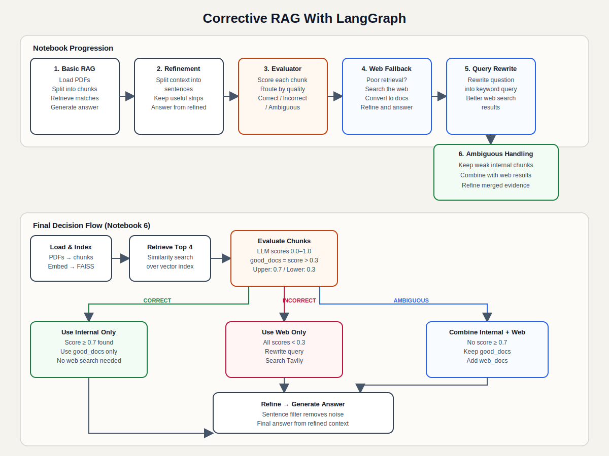

# Corrective RAG With LangGraph

This project is a notebook-based implementation of a corrective Retrieval-Augmented Generation (RAG) workflow using LangGraph, FAISS, OpenAI embeddings, and OpenAI chat models.

The repo starts from a basic RAG pipeline and gradually adds:

- sentence-level retrieval refinement
- chunk scoring with an LLM judge
- web-search fallback for poor retrieval
- query rewriting for better web search
- ambiguous-case handling by combining internal and external knowledge

The overall goal is to move from "retrieve and answer" to "retrieve, evaluate, correct, then answer".

## Flow Diagram



If you only want the big picture, this diagram is the fastest way to understand how the notebooks evolve and how the final routing logic works.

## Project Idea

This repo is inspired by the paper:

- [Corrective Retrieval Augmented Generation](https://arxiv.org/pdf/2401.15884)

Instead of reproducing the paper exactly, this project implements the main corrective flow using OpenAI models:

- retrieve relevant chunks from local documents
- score whether the retrieved chunks are good enough
- refine useful knowledge at sentence level
- fall back to web search when retrieval is weak
- combine internal and external knowledge when retrieval is ambiguous

## Tech Stack

- Python
- Jupyter Notebooks
- LangChain
- LangGraph
- FAISS
- OpenAI Embeddings
- OpenAI Chat Models
- Tavily Web Search

## Repository Structure

- [1_basic_rag.ipynb](1_basic_rag.ipynb): basic retrieval + answer generation
- [2_retrieval_refinement.ipynb](2_retrieval_refinement.ipynb): adds sentence-level refinement
- [3_retrieval_evaluator.ipynb](3_retrieval_evaluator.ipynb): adds retrieval scoring and routing
- [4_web_search_refinement.ipynb](4_web_search_refinement.ipynb): adds web fallback for incorrect retrieval
- [5_query_rewrite.ipynb](5_query_rewrite.ipynb): improves web fallback through query rewriting
- [6_ambiguous.ipynb](6_ambiguous.ipynb): handles ambiguous retrieval by combining internal and web evidence
- [evaluate_crag.py](evaluate_crag.py): RAGAS evaluation script comparing all 3 CRAG variants
- [eval_data/](eval_data/): golden dataset (10 Q&A pairs) + attention paper PDF
- [documents/](documents/): source PDFs used by the notebooks
- [requirements.txt](requirements.txt): Python dependencies

## How The Pipeline Evolves

### 1. Basic RAG

The starting notebook loads PDF documents, splits them into chunks, embeds them, stores them in FAISS, retrieves the top matching chunks, and generates an answer.

### 2. Retrieval Refinement

The next step improves retrieval quality by:

- combining retrieved chunks
- splitting them into sentence-level strips
- using an LLM to keep only the sentences that directly help answer the question
- generating from the refined context instead of the full raw chunks

### 3. Retrieval Evaluation

The next notebook introduces a retrieval evaluator that scores each retrieved chunk against the question.

It uses two thresholds:

- `UPPER_TH = 0.7`
- `LOWER_TH = 0.3`

Routing logic:

- `CORRECT`: at least one chunk scores above `0.7`
- `INCORRECT`: all chunks score below `0.3`
- `AMBIGUOUS`: everything in between

Chunks with `score > 0.3` are stored as `good_docs`.

### 4. Web Search Fallback

If retrieval is judged `INCORRECT`, the system falls back to Tavily web search, converts those results into `Document` objects, refines them, and answers from the refined web knowledge.

### 5. Query Rewriting

Instead of sending the raw user question directly to web search, the pipeline rewrites the question into a short keyword-style search query for better external retrieval.

### 6. Ambiguous-Case Correction

If retrieval is `AMBIGUOUS`, the system:

- keeps the weakly relevant internal chunks
- rewrites the query for web search
- fetches web results
- combines internal and external knowledge
- refines the combined context
- generates the final answer

This is the most complete corrective version in the repo.

## Setup

### 1. Create a virtual environment

```bash
python -m venv .venv
source .venv/bin/activate
```

### 2. Install dependencies

```bash
pip install -r requirements.txt
```

If you want to run the later notebooks with web search, you may also need:

```bash
pip install tavily-python
```

### 3. Add environment variables

Create a `.env` file with:

```env
OPENAI_API_KEY=your_openai_api_key
TAVILY_API_KEY=your_tavily_api_key
```

`TAVILY_API_KEY` is needed for the notebooks that use Tavily search.

### 4. Launch Jupyter

```bash
jupyter notebook
```

or

```bash
jupyter lab
```

Then run the notebooks in order from `1_basic_rag.ipynb` to `6_ambiguous.ipynb`.

## Data Flow Summary

At a high level, the later notebooks follow this pattern:

1. Load PDFs from `documents/`
2. Split into overlapping chunks
3. Create embeddings with `text-embedding-3-large`
4. Store chunks in FAISS
5. Retrieve top 4 chunks for the user question
6. Score each chunk using an LLM judge
7. Route to one of:
   - internal refinement
   - web search fallback
   - internal + web combination
8. Filter knowledge at sentence level
9. Generate the final answer using only the refined context

## Important Notes

- This is a notebook-first project, not a packaged Python application.
- The implementation is inspired by CRAG, but it does not reproduce the paper's exact trained evaluator.
- The chunk evaluator, sentence filter, and query rewrite steps are implemented using OpenAI chat models.
- Web search results are refined at the sentence level, but they are not re-scored by the same chunk evaluator in the current version.
- The flow is single-pass and does not loop until confidence improves.

## Current Limitations

- No packaged `src/` structure yet
- No automated test suite
- Dependencies are lightly pinned
- Tavily usage is required for the web-search notebooks
- The current implementation is better described as CRAG-inspired than paper-exact

## RAGAS Evaluation

`evaluate_crag.py` benchmarks three variants of the pipeline against a 10-question golden dataset
(questions about the "Attention Is All You Need" paper).

### Variants

| Variant | Logic |
|---------|-------|
| **basic** | Notebook 1: retrieve top-4, answer directly, no scoring |
| **correct** | Notebook 5: score chunks → CORRECT→internal, INCORRECT→web, AMBIGUOUS→message |
| **full** | Notebook 6: CORRECT→internal, INCORRECT/AMBIGUOUS→web (AMBIGUOUS also uses internal) |

### Results

| Metric | basic | correct | full |
|--------|-------|---------|------|
| Faithfulness | 0.9500 | 0.8333 | 0.9000 |
| Answer Relevancy | 0.9919 | 0.8879 | 0.9901 |
| Context Precision | 0.7667 | 0.9000 | 0.9000 |
| Context Recall | 0.9000 | 0.9000 | 0.8500 |

**Reading the numbers:**
- `basic` scores highest on generation metrics because the attention paper is in the index and top-4 chunks almost always contain the answer — no filtering risk.
- `correct`/`full` win on context precision — the LLM scorer removes noisy chunks that `basic` passes through raw.
- `correct` faithfulness dip comes from AMBIGUOUS questions returning a non-answer message instead of generating a real answer.
- `full` is the most balanced overall — it routes AMBIGUOUS into web+internal rather than returning a message.

### Comparison with LangGraph RAG (query strategy: none)

| Metric | CRAG correct | LangGraph none |
|--------|-------------|----------------|
| Faithfulness | 0.8333 | 0.9104 |
| Answer Relevancy | 0.8879 | 0.8628 |
| Context Precision | 0.9000 | 0.6667 |
| Context Recall | 0.9000 | 0.8000 |

CRAG's chunk scorer clearly improves retrieval quality (+0.23 precision, +0.10 recall).
LangGraph's higher faithfulness is mostly explained by CRAG's AMBIGUOUS penalty, not a generation quality difference.

### Running the evaluation

```bash
pip install -r requirements.txt
python evaluate_crag.py
```

`OPENAI_API_KEY` is required. `TAVILY_API_KEY` is optional — web search steps degrade gracefully if not set.

Results are saved to `eval_results_crag_basic.json`, `eval_results_crag_correct.json`, `eval_results_crag_full.json`.

## Summary

This repo shows the progression from basic RAG to a corrective RAG-style system that evaluates retrieval quality, refines knowledge, and uses web search when internal retrieval is weak or ambiguous. A RAGAS evaluation script quantifies the impact of each corrective step across all pipeline variants.
